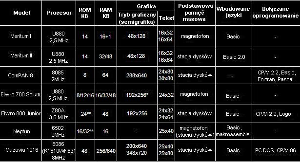

### Artykuł "Stare polskie komputery" wzięty z forum [speccy.pl](https://www.speccy.pl/forum/index.php?topic=2340.15)
### Pierwotnie dostępny prawdopodobnie w [Dziennik miłośnika polskich komputerów](https://web.archive.org/web/20140513024929/http://www.elwro.zafriko.pl/kat/_____artykuLy/komputery_w_polsce)

Nie ulega wątpliwości, że liczba wszystkich wyprodukowanych w Polsce mikrokomputerów jest znacznie mniejsza od tygodniowej choćby produkcji zachodniej firmy komputerowej. Sytuacja ta bezpośrednio jest związana z luką technologiczną, która powstała między krajami przodującymi w tej dziedzinie a Polską. W Polsce brak jest mikroprocesorów, pamięci półprzewodnikowych, układów układów o dużej skali integracji, a w szczególności pamięci dyskowych.

Obecnie jedynym produkowanym w Polsce mikroprocesorem jest MCY 7880, wzorowany na przestarzałym 8-bitowym mikroprocesorze INTEL 8080. Pamięci zewnęstrzne na dyskach elastycznych (8-calowe, ostatnio też i 5 1/4-calowe), produkowane przez krakowską fabrykę MERA KFAP w bardzo małej liczbie, nie zabezpieczają wewnętrznego popytu i nie są najwyższej jakości. Realizacja zamówienia na drukarkę mozaikową z rodziny D-100 wyprodukowaną przez ZMP MERA-BŁONIE trwa kilka lat.

Sytuacja ta spowodowała powstawanie wielu prywatnych przedsiębiorstw (część z nich powstała w kooperacji z firmami zachodnimi), które zajęły się produkcją lub bezpośrednictwem w sprzedaży zestawów mikrokomputerowych. W wyniku ich działalności montowano lub były tylko sprzedawane takie mikrokomputery jak:

- ZX 81 (AC 581), AC 805, AC 8115, AC 825, AC 864, AC 8512 (rozpowszechniane przez Przedsiębiorstwo Polonijno-Zagraniczne PPZ Ameprod),
- ZX Spectrum, ZX Spectrum+, APC 16 (IBM PC) (z firmy PPZ Apina),
- ZX Spectrum, ZX Spectrum+, Polbrit 2086 (firma PPZ Polbrit),
- EMIX 86 PC (IBM PC/XT), EMIX II (Apple II) (Przedsiębiorstwo Zagraniczne Wielobranżowe EMIX),
- komputery zgodne z Apple II oraz LIDIA II (IBM PC/XT) (Computer Studio Kajakowscy),
- CS-80 PC, CS-88 PC (PPZ Computex),
- imp 85, imp 85w, imp 86 (IBM PC) (PPZ IMPOL II),
- NEPTUN 184 (Pracownia Elektroniki Medycznej),
- Amstrad/Schneider CPC 464 oraz komputery zgodne z IBM PC/XT (PPZ POL-ROL),
- komputery zgodne z IBM PC/XT oraz IBM PC/AT - Reflex.

Podana lista nie jest kompletna, wymieniono jedynie firmy, które jako pierwsze zajęły się sprzedażą komputerów osobistych. Obecnie komputery (głównie zgodne z IBM PC oraz firmy Amstrad) sprzedaje kilkaset firm z całego kraju. Komputery te pochodzą głównie z prywatnego importu.

Przedsiębiorstwa państwowe również prubowały produkować mikrokomputery. Najbardziej liczącymi się przedstawicielami mikrokomputerów wyprodukowanych przez te zakłady są:

- MERITUM I, MERITUM II, RTDS 8, ComPAN 8 (producent MERA-ELZAB)
- MK 4501/2, KRAK (producent MERA-KFAP)
- ELWRO 600, ELWRO 700 (SOLUM), ELWRO 800, ELWRO 800 JUNIOR (producent MERA-ELWRO)
- MAZOVIA 1016 (polski IBM PC/XT) (producent spółka Mikrokomputery: ERA Warszawa, MERA Błonie, Polon Warszawa, REFA Świębodzice, IMM, Metronex i UNITRA PHZ).

Nie wszystkie ze wspomnianych komputerów zasługują na uwagę, gdyż: produkcję części z nich zaniechano, liczba wyproduwowanych egzemplarzy jest znikoma, firmy zajmujące się ich produkcją (dystrybucją) zostały rozwiązane (...)

W dalszej części rozdziału przedstawione zostaną tylko modele, które naszym zdaniem są (lub mają szansę) być stosunkowo popularne na rynku krajowym.

## MERITUM

Mikrokomputer MERITUM został zaprojektowany przez PPZ ITM, a jego produkcję podjęły Zakłady Urządzeń Komputerowych MERA-ELZAB. Sprzętowo jest wzorowany na amerykańskim komputerze osobistym TRS-80 model II (Tandy Radio Shack), zastosowano procesor Z80. Oprogramowanie podstawowe stanowi interpreter języka BASIC, rezydujący w pamięci ROM. Zajmuje on 12 KB. Realizacja języka jest zbliżona do starej wersji Microsoft Basic. MERITUM I ma 16 KB (MERITUM II - 32 KB) pamięci zapisywalnej.

Klawiatura MERITUM typu QWERTY jest kontraktonowa. Składa się z 55 klawiszy oraz klawisza RESET. W wersji MERITUM II polskie litery są dostępne bezpośrednio distępne z klawiatury. Możliwe jest również zaprogramowanie własnego generatora znaków. Klawiatura MERITUM należy do najbardziej trwałych elementów tego komputera.

Klawiaturę MERITUM uzupełniono o klawisz NMI (ang. Non Maskable Interrupt). Jego wciśnięcie pozwala przerwać wykonywanie dowolnego programu bez usuwania go z pamięci komputera z zachowaniem zawartości poszczególnych rejestrów procesora.

W trybie znakowym na ekranie dostępne jest 16 wierszy po 32 lub 64 znaki w każdym. W związku z tym pamięć obrazu zajmuje tylko 1 KB. Niestety, MERITUM I i II nie mają ani kolorowej, ani czarno-białej grafiki wysokiej rozdzielczości, a jedynie monochromatyczną semigrafikę, wykorzystującą 64 specjalne symbole graficzne.

Komputer ten nie ma modulatora RF i nie może bezpośrednio współpracować z telewizorem. Generuje on natomiast złożony sygnał wizyjny, możliwe jest więc dołączenie go do monitora TV (np. Neptun 156).

Jako podstawowej pamięci zewnętrznej użyto magnetofonu kasetowego. Dane transmitowane są ze średnią szybkością ok. 500 bodów, np. transmisja całej zawartości pamięci RAM na taśmę magnetofonową trwa około 4 minut. Na zakończenie zapisu lub odczytu z taśmy dowolnej informacji (np. programów Basicu) jest sprawdzana tzw. suma kontrolna. Jest to jedyny sposób weryfikacji poprawności zapisu lub odczytu. Brak możliwości bieżącej kontroli (choćby akustycznej) transmisji danych z/do magnetofonu jest bardzo poważną wadą tego komputerów.

MERITUM II jest wyposażony autonomiczny system dyskowy z dwiema stacjami dysków 5 1/4 cala, o zapisie pojedynczej gęstości o pojemności ok. 100 KB (napędy typu K5600.10 produkcji NRD). MERITUM II może dzięki temu pracować pod nadzorem systemu operacyjnego CP/M 2.2. Stacje K5600 nie cieszą się wśród użytkowników dobrą opinią (Cytując ich użytkowników można powiedzieć, że stacje K5600 prawie nie działają). W związku z instalacją dysków stacji BASIC MERITUM II został rozszerzony o podstawowe instrukcje dyskowe.

Do komputera MERITUM jest wbudowany szeregowy układ sprzęgający pracujący w standardzie RS 232C. Poza łączem szeregowym MERITUM ma równoległy układ dopasowujący zbudowany z wykorzystaniem układu scalonego 8255 lub jego polski odpowiednik MCY 7855.

Wersji MERITUM III z kolorową grafiką dużej rozdzielczości chyba się nie doczekamy, gdyż obecnie nie ma producenta, który zechciałby kontynuować produkcję tego komputera. Obecnie jest w użyciu mniej niż 10 000 sztuk mikrokomputera tego typu.

## ComPAN 8

Mikrokomputer ComPAN 8 został zaprojektowany w Zakładzie Systemów Automatyki Przemysłowej PAN w Gliwicach, natomiast jego produkcją zajęły się zakłady MERA-ELZAB w Zabrzu. Komputer ten jest przede wszystkim przeznaczony do wspomagania projektowania, badań naukowych oraz może być zastosowany jako inteligentny terminal większości systemów. Jego cechą charakterystyczną jest modułowa budowa.

ComPAN 8 ma 8-bitowy procesor Intel 8080A. Moduł centralny oprócz procesora zawiera 8-poziomowy kontroler przerwań oraz układ bezpośredniego dostępu do pamięci. Zastosowany procesor ma możliwość bezpośredniej adresacji do 64 KB pamięci. Zastosowanie rozszerzonej o pięć linii magistrali adresowej (A 16...A 20) pozwala na bezpośrednią adresację do 2 MB pamięci.

Pamięć stała zajmuje 8 KB. Zapiano w niej program zarządzający i monitor, który zostaje uruchomiony automatycznie po włączeniu zasilania. Zadaniem tego programu jest sterowanie mikrokomputerem, uruchamianie, testowanie i ładowanie programów.

Klawiatura ComPAN-a 8 (typu MERA 7946M) składa się z 83 klawiszy. Z prawej strony wyeksponowane są klawisze numeryczne, natomiast w górnym rzędzie- klawisze funkcyjne.

Standardową pamięcią zewnętrzną są dyski elastyczne. Moduł sterownika pozwala na dołączenie do systemu 4 napędów. Stosuje się tu stacje 8" lub 5 1/4", podobnie jak w MERITUM - czyli typu K5600.10.

Urządzenia peryferyjne do ComPAN-a mogą być podłączane przez wbudowane standardowe układy sprzęgające. Poza łączem sterownika dysków znajdują się tam dwa łącza szeregowe typu RS 232C, łącze równoległe oraz układ sprzęgający do drukarki.

Podstawowym dyskowym systemem operacyjnym jest CP/M wersja 2.2. Użycie tego systemu gwarantuje dostęp do dużej biblioteki oprogramowania. Komputer ten może zostać wyposażony w system operacyjny ISIS-II z makroasemblerem oraz kompilatorami języków PL/M i FORTRAN.

Moduł generacji obrazu tworzy na ekranie monitora TV monochromatyczny obraz. Ekran podzielony jest na okna, w których są wyświetlane fragmenty pamięci obrazu. Dolne cztery wiersze (po 80 znaków) stanowią okno systemowe. Nad nim znajduje się okno robocze, które w zależności od trybu pracy zawiera:

- 24 wiersze po 80 znaków w trybie znakowym,

- 30 wierszy po 80 znaków w trybie graficzno-znakowym,

- 288 x 640 punktów w trybie graficznym.

  ComPAN 8 ma również możliwość wyślietlania dodatkowego okna systemowego o organizacji 8 wierszy po 30 znaków. Jest ono wyświetlane w górnej części ekranu.

  Każde słowo pamięci obrazu jest 12-bitowe. Znaczenie pierwszych ośmiu bitów zależy od trybu pracy. Reprezentują one albo kod znaku albo fragment obrazu. Cztery dodatkowe bity określają atrybuty: podkreślenie, migotanie, tryb inwersyjny oraz typ generatora znaków. W trybie znakowym oraz znakowo-graficznym korzysta się z niezależnych genaratorów znaków. Możliwe jest zdefiniowanie własnego generatora znaków.

  ComPAN 8  ma również standardowy zestaw procesów graficznych, które pozwalają na deklarowanie trybów pracy, zapis i odczyt znaku z atrybutem, ustalenie pozycji okna w pamięci obrazu, sterowanie wysuwem linii i punktów oraz szybkie wypełnianie i przemieszczanie obszarów pamięci operacyjnej.

  Na omawianym komputerze dostępne są liczne programy:

- interpretery języków Basic o Forth,

- kompilatory języków Basic, PL/M, FORTRAN i Pascal,

- pokaźna biblioteka oprogramowania pod system CP/M.

  Podstawową wadą tego komputera jest jego duża zawodność. Jest ona związana z zawodną pracą napędów dyskowych oraz z przegrzewaniem się elementów. Często użytkownicy ComPAN-a chłodzą swój komputer za pomocą zewnętrznego wentylatora.

  Roczna produkcja ComPAN-a jest bardzo mała - rzędu setek sztuk rocznie. Zapowiadanej od dwóch lat produkcji ComPAN-a 16 do tej pory nie uruchomiono.

## ELWRO 800

Koncepcja tego komputera wzbudziła duże zainteresowanie. Ma on być zgodny z IBM PC. Jego otwarta architektura umożliwia rozbudowę o dodatkowe moduły, co pozwala na zwiększenie możliwości dołączenia go do innych systemów komputerowych oraz zastosowanie jako sterownika przemysłowego.

Niestety jak dotychczas komputer ten nie jest produkowany, dlatego poprzestaniemy na tych ogólnych informacjach.

## ELWRO 800 JUNIOR

Model komputera osobistego ELWRO 800 Junior został opracowany przez pracowników Instytutu Automatyki Politechniki Poznańskiej w Poznaniu oraz przez pracowników Instytutu Komputerowych Systemów Automatyki i Pomiarów w Wrocławiu. Jest to kolejny przedstawiciel rodziny ELWRO 800.

Komputer ten był opracowany z myślą o zastosowaniu go w polskich szkołach. Projekt jako najlepszy z zaprezentowanych Ministerstwu Oświaty i Wychowania zdobył sobie uznanie tego resortu i został zaakceptowany jako polski komputer szkolny (Inną propozycją komputera szkolnego był ELWRO 700 SOLUM, eksponowany na Międzynarodowych Targach Poznańskich w 1985r., jednak nie zyskał on zbyt pochlebnych opinii, podobnie jak komputer MERITUM).

ELWRO 800 Jr został wyposażony w 8-bitowy mikroprocesor Z80 A (lub jego odpowiednik U880 produkowany w NRD). Ma on stronicową pamięć operacyjną, kolorową grafikę, prosty generator dźwięków, pakiet lokalnej sieci komputerowej, sterownik pamięci na dyskach elastycznych, łącze magnetofonowe oraz dodatkowe układy wejścia-wyjścia.

W jednym z trybów pract jest on w pełni zgodny z obecnie najbardziej popularnym w Polsce komputerem domowym ZX Spectrum 48 KB. Zgodność ta jest tak daleko posunięta, że powielono również błędy znajdujące się w ROM-ie ZX Spectrum. Format zapisu informacji na taśmie i adresy urządzeń zewnętrznych są w obu komputerach identyczne. Zapewnia to ELWRO 800 Jr dostęp do znacznej biblioteki oprogramowania zarówno z importu, jak i tego, które zostało stworzone dla ZX Spectrum przez polskich informatyków, hobbystów i nauczycieli. Takie rozwiązanie pozwoliło uniknąć wywarzania otwartych drzwi.

Pamięć stała zajmuje 24 KB. W pamięci tej umieszczone jest oprogramowanie podstawowe, w tym: interpreter języka Basic, program edytora, część dyskowego systemu operacyjnego oraz programy sterujące magnetofonem kasetowym, komputerową siecią lokalną oraz drukarką graficzną.

ELWRO 800 Jr może współdziałać z pamięcią na dyskach elastycznych. Sterownik zapewnia obsługę dwóch napędów dyskowych 5 1/4". Zapis na dyskietkach jest dokonywany z podwóją gęstością, a pojemność jednej dyskietki w zależności od  zastosowanego napędu wynosi 175...800 KB. Stacje dysków montowane w pierwszej serii pochodzą z importu, głównie z Węgier i NRD.

ELWRO 800 Jr jest wyposażony w dyskowy system operacyjny o nazwie CPO8, który jest w pełni zgodny z systemem CP/M wersja 2.2. Może więc programów narzędziowych i użytkowych.

Pojemnościowa klawiatura składa się z 58 klawiszy. W trybie pracy zgodnym z ZX Spectum słowa kluczowe języka Basic są wprowadzane przez naciśnięcie pojedynczego klawisza, ale ELWRO 800 Jr ma również możliwość wprowadzania słów klczowych literka po literce. Bezpośrednio z klawiatury można wprowadzać polskie litery.

Możliwe są trzy trybuy wyświetlania na ekranie: dwa znakowe i jeden graficzny wysokiej rozdzielczości. W trybie znakowym na ekranie mogą być wyświetlanie 24 linie po 32 lub po 64 znaki w każdej. W trybie wysokiej rozdzielczości ekran jest podzielony na 192 punkty w pionie i 256 punktów w poziomie. Obraz może być 16-kolorowy i może migotać.

ELWRO 800 Jr ma dwa gniazda, do których można dołączyć monitory. Jedno wyjście pozwala na dołączenie monitora kolorowego w systemie SECAM. Natomiast drugie wyjście umożliwia podłączenie monochromatycznego monitora (np. Neptun 156) lub, przez modulator, telewizora czarno-białego.

Do ELWRO 800 Jr, przez wbudowane łącze równoległe o standarcie Centronics i szeregowe RS 232C, można znakową lub graficzną, manipulator drążkowy, pióro świetlne, myszkę i wiele innych urządzeń. Otwarta struktura sprzętowa pozwala na łatwą rozbudowę systemu o kolejne bloki funkcjonalne.

Program obsługujący lokalną sieć komputerową rezyduje w pamięci EPROM. Dzięki niemu oraz odpowiednim łączom możliwe jest połączenie kilkudziesięciu komputerów ELWRO 800 Junior, a nawet współpraca z profesjonalnym komputerem ELWRO 800. Jest to bardzo istotne z punktu widzenia zastosowań szkolnych. Praca komputerów w sieci pozwala na korzystanie przez wszystkie jednostki ze wspólnych zasobów, np. drukarek czy szybkich pamięci zewnętrznych. W sieci możliwe jest  przesyłanie obrazów, programów lub określonych obszarów pamięci operacyjnej między połączonymi komputerami, z zachowaniem odpowiednio wybranych priorytetów oraz kierunków transmisji.

Z myślą o szkole komputer ELWRO 800 Jr został wyposażony w wyjście pozwalające na dołączenie do jednego magnetofonu kilkudziesięciu komputerów. Dzięki temu jest możliwe jednoczesne ładowanie programuz jednego magnetofonu do wszystkich podłączonych w ten sposób komputerów.

Cena (dane z 1986r) podstawowgo zestawu ELWRO 800 Jr ma kształtować się na poziomie 100 000 zł. Natomiast za zestaw ze stacją dysków oraz drukarką prawdopodobnie trzeba będzie zapłacić około 800 000 zł.

Do końca 1986 r planowano wyprodukować 500 sztuk tych komputerów. W następnym roku ma ich być 5000, a produkca docelowa (nie wiadomo kiedy to nastąpi) ma wynieść 30 000 sztuk rocznie. Biorąc pod uwagę dynamikę postępu w tej branży, za kilka lat, po paśmie tzw. trudności obiektywnych, komputer ELWRO 800 Junior może okazać się przysłowiową musztardą po obiedzie.

## MAZOVIA 1016

Komputer osobisty MAZOVIA 1016, montowany przez spółkę z ograniczoną odpowiedzialnością "Mikrokomputery", jest w pełni zgodny z IBM PC/XT.

MAZOVIA ma 16-bitowy mikroprocesor INTEL 8086 lub jego radziecki odpowiednik K1810WM86. Podstawowa pamięć zapisywalna ma 256 KB (i może być rozszerzona do 640 KB). Pamięć stała ROM zajmuje 48 KB. Umieszczony jest w niej interpreter języka Basic oraz zestaw procedur współpracy z urządzeniami zewnętrznymi BIOS.

Klawiatura o układzie QWERTY składa się z 84 klawiszy. W tak zwanym polskim trybie pracy klawiatury dostępne są polskie litery, a rozkład klawiszy jest zgodny z rozkładem klawiszy w standardowej maszynie do pisania. Producenci przewidują, że w przyszłości możliwe będzie przełączenie klawiatury w tryb pracy z rosyjskim alfabetem.

Podstawowym dyskowym systemem operacyjnym jest spolszczony MS DOS. Spółka przystosowuje do potrzeb polskiego użytkownika również inne systemy operacyjne, jak: CP/M 86 czy XENIX. Poza tym do sprzedaży przygotowuje się spolszczone oprogramowanie typu: bazy danych, programy kalkulacyjne, edytory tekstów, itp.

MAZOVIA jest wyposażona w łącze o standardzie Centronics, pozwalające na bezpośrednie dołączenie drukarki D-100PC (MERA-BŁONIE). W przyszłości przewiduje się dołączenie dysku stałego typu Winchester o pojemności 10 lub 20 MB.

Do końca 1986 roku planowano wyprodukować 500 sztuk tych komputerów, a w 1987 roku około 5000. Do chwili obecnej mimo zapowiedzi produkcji nie podjęto.

MAZOVIA ma być podstawowym wyposażeniem wyższych uczelni oraz instytutów naukowo-badawczych. W stosunku do rozwiązań światowych już w tej chwili jest przestarzała. Wprawdzie jest zapowiadana MAZOVIA 2016 zgodna z IBM PC/AT, ale dotychczas nie zaprezentowano prototypu, od którego do produkcji wiedzie przecież bardzo daleka droga.

Cena MAZOVII 1016 z monochromatycznym monitorem i drukarką ma wynieść około 3 000 000 zł i obecnie jest ona wyższa od ceny proponowanej za podobny zestaw przez firmy sprzedające dalekowschodnie kopie IBM PC.

http://www.elwro.zafriko.pl/kat/_____artykuLy/komputery_w_polsce
